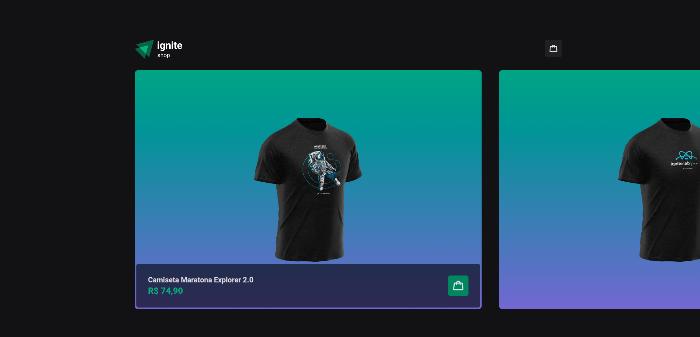
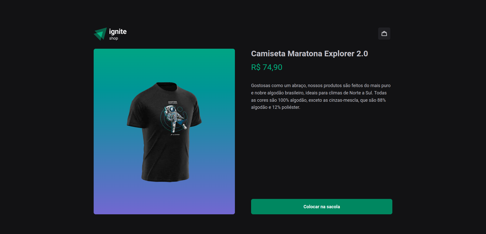
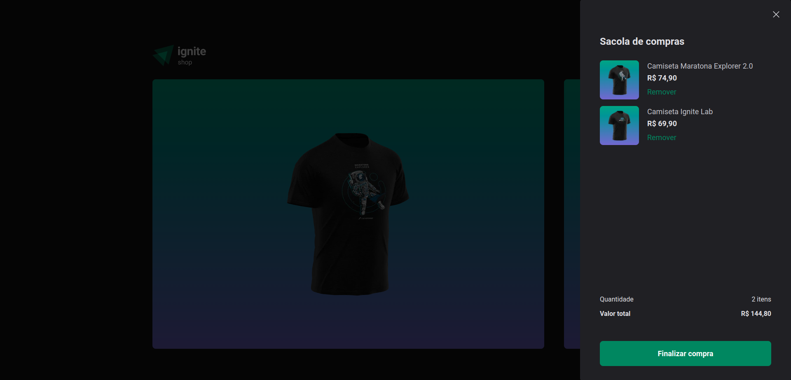
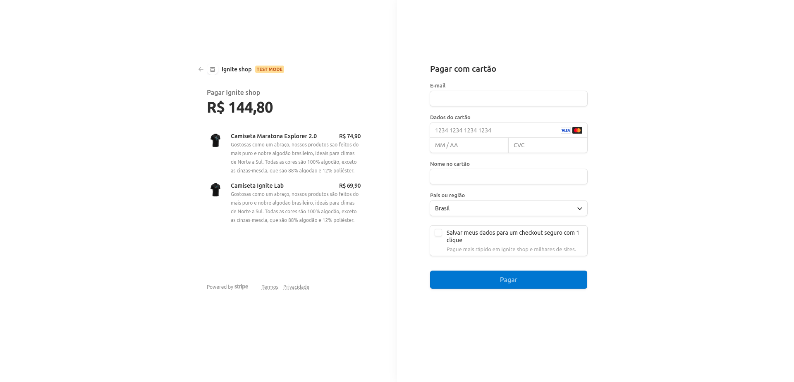
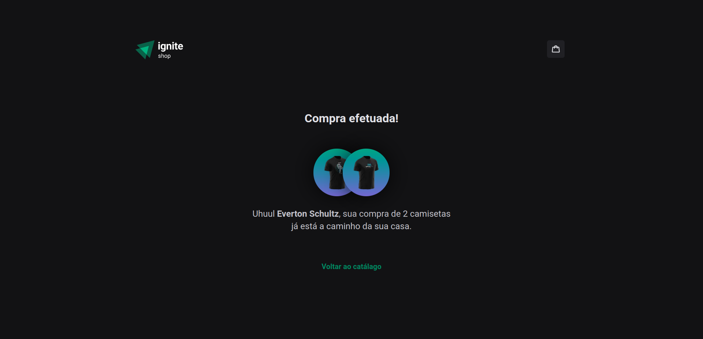

# IGNITE SHOP

## 💻 Sobre o projeto

É uma aplicação que utiliza a API do Stripe para buscar produtos.
O projeto foi desenvolvido durante as aulas, tendo sequência no desafio 04 da trilha atualizada de ReactJs do Ignite, disponibilizado pela Rocketseat.

---

## ⚙️ Funcionalidades

- Listagem de produtos com imagem, nome e preço.
- Página com maiores detalhes do produto.
- Carrinho de compras.
- Compra de produtos.

Para o desenvolvimento foram aplicados conceitos como:
- Axios
- Stitches
- React Dialog
- Keen Slider
- Stripe
- Shopping Cart
- TypeScript

---

## 🎨 Layout

### Web

<p align="center" style="display: flex; align-items: flex-start; justify-content: center;">
  

  

  

  

  
</p>

---

## 🚀 Como executar o projeto
A aplicação foi desenvolvida utilizando [Next.js](https://nextjs.org/docs/getting-started)

### Pré-requisitos
Antes de começar, você vai precisar ter instalado em sua máquina o [Git](https://git-scm.com). Além disso, é bom ter um editor para trabalhar com o código como [VSCode](https://code.visualstudio.com/). Também considere utilizar a documentação do [Next.js](https://nextjs.org/docs/getting-started) para fazer alterações no projeto.

#### Rodando a aplicação web (Frontend)
```bash

# Clone este repositório
$ git clone git@github.com:evertonschultz/04-ignite-shop.git

# Acesse a pasta do projeto no seu terminal/cmd
$ cd 04-ignite-shop

# Instale as dependências
$ npm install

# Execute a aplicação em modo de desenvolvimento
$ npm run dev

# A aplicação será aberta na porta:3000 - acesse http://localhost:3000

```

---

## 🛠 Tecnologias
As seguintes ferramentas foram usadas na construção do projeto:

#### **Website**  [Next.js](https://nextjs.org/docs/getting-started)

-   **[Radix UI / React Dialog](https://www.radix-ui.com/docs/primitives/components/dialog)**
-   **[Stitches / React](https://stitches.dev/docs/installation)**
-   **[Axios](https://axios-http.com/ptbr/docs/intro)**
-   **[Keen Slider](https://keen-slider.io/)**
-   **[Next.js](https://nextjs.org/docs/getting-started)**
-   **[Phosphor React](https://phosphoricons.com/)**
-   **[Stripe](https://stripe.com/br)**
-   **[Use Shopping Cart](https://useshoppingcart.com/docs/)**

## 🦸 Autor

 <br />
 <sub><b>Everton Schultz</b></sub></a>
 <br />

[](https://www.linkedin.com/in/https://www.linkedin.com/in/%C3%A9verton-schultz-824a1612b/)
[](mailto:evertonf.m.schultz98@gmail.com)

## License
Este projeto pode ser usado por qualquer pessoa! Licença MIT

